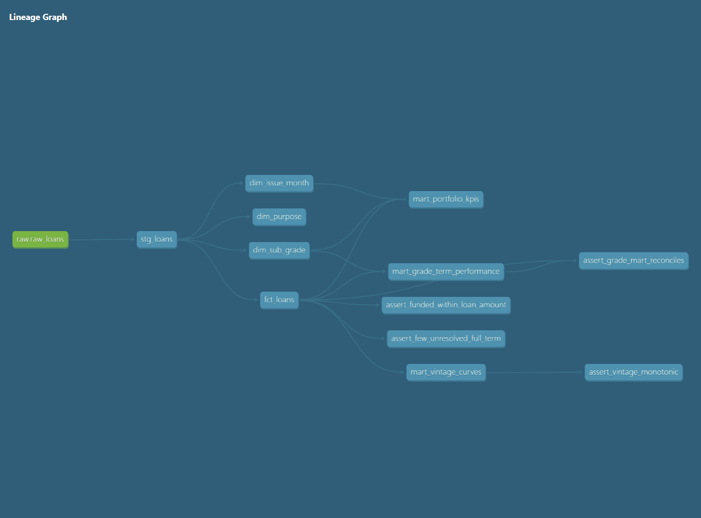

# LendingClub Loan Performance: SQL + Tableau

**Dashboard:** [LendingClub Loan Performance on Tableau Public](https://public.tableau.com/app/profile/brian.hoang5766/viz/LendingClubLoanPerformanceSQLTableau/Overview)

## Question
For LendingClub loans with a complete performance history, how do default rates and realized cash repayment differ by grade and term, and how quickly do defaults build up in each issue-year cohort?

## Findings
1. **Default risk climbs steeply by grade.** Among fully observed 36-month loans, default rates rose from 5.5% in grade A to 32.0% in grade F (36.0% in grade G, a small sample of 425 loans).
2. **Higher rates did not return more cash per dollar.** The 36-month cash-return proxy peaked at grade B (9.4%) and fell to 6.5% at grade F, even though grade F loans averaged a 23.7% interest rate versus 11.0% for grade B.
3. **Newer cohorts defaulted faster.** 24-month cumulative default rates for 36-month loans rose from 7.3% (2010 cohort) to 11.6% (2015 cohort).

## Data and definitions
- **Source:** LendingClub accepted loans, 2007 to 2018 Q4 ([Kaggle](https://www.kaggle.com/datasets/wordsforthewise/lending-club)). 2,260,701 raw rows; 2,257,919 loans after dropping 33 summary rows and 2,749 "does not meet credit policy" loans.
- **As-of date:** 2019-03-01, the latest payment date in the file.
- **Full-term cohort:** issue month + term + 6 months <= as-of date. This keeps 573,011 loans (529,921 at 36 months, 43,090 at 60 months). Only 0.001% of them are still unresolved.
- **Default:** status of Charged Off or Default. Default rate = defaults / (paid + defaults).
- **Cash-return proxy:** total payments / funded amount - 1, pooled and dollar-weighted. `total_pymnt` already includes recoveries, so recoveries are not added again.
- **Vintage curves:** default timing uses months from issue to last payment. Each cohort's curve stops at its observed age minus the 6-month grace.

## What this can and cannot conclude
- **Can:** describe historical default and cash-repayment patterns for these LendingClub cohorts.
- **Cannot:**
  - Show that pricing was profitable. The proxy ignores fees, funding costs, taxes and the time value of money, and it is not annualized.
  - Show that grade causes default.
  - Say anything about rejected applicants.
  - Predict performance for other lenders or later periods.
- Compare grades within a term, not across terms. 60-month full-term loans only come from 2010 to 2013.
- Last payment date is a proxy for default timing, so curves run a few months early.

## Architecture

`raw_loans` (all text) -> `stg_loans` -> `fct_loans` + 3 dimensions -> 3 marts -> Tableau

- **Staging:** type casting, date parsing, removal of junk and off-policy rows
- **Core:** a loan-grain fact table with outcome and observation-window flags; dimensions hold only origination-time fields
- **Marts:** `mart_portfolio_kpis`, `mart_grade_term_performance`, `mart_vintage_curves`
- **10 dbt tests:**
  - Keys: unique and not-null loan IDs
  - Accepted values: grades and terms
  - Relationships: every fact row joins to its dimensions
  - Funded-amount bounds
  - Unresolved-share check on the full-term cohort
  - Monotonic vintage curves
  - Mart-to-fact reconciliation

## Run it
1. Download `accepted_2007_to_2018Q4.csv.gz` from Kaggle into `data/`.
2. `py -3.12 -m venv venv`, activate it, then `pip install dbt-core dbt-duckdb duckdb pandas`.
3. `python scripts/load_raw.py`
4. `cd lending`, then `dbt build`
5. `cd ..`, then `python scripts/export_marts.py`. The CSVs in `exports/` feed the Tableau workbook.

## Tools
SQL (DuckDB), dbt, Python, Tableau Public, Git
